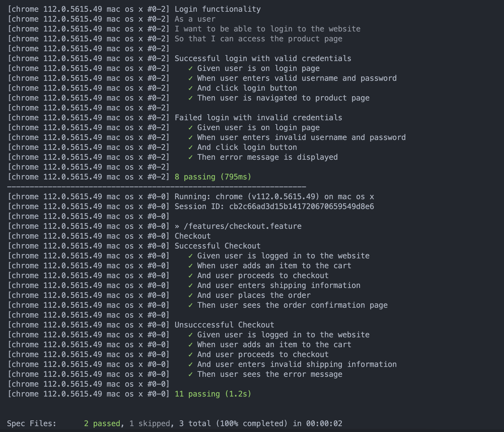
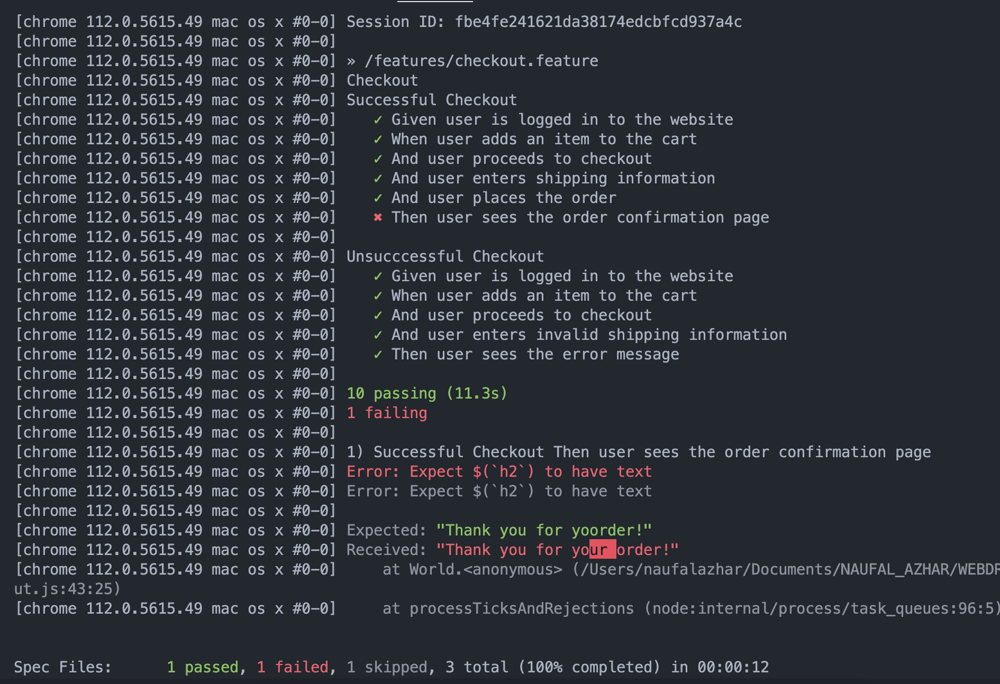

- This is a sample code for automated testing using the Cucumber framework and WebDriverIO. The code defines a series of steps to perform functional tests on a web application.

- The first set of steps is related to the login page. It checks whether a user can log in with valid or invalid credentials and verifies whether the user is redirected to the correct page or sees an error message.

- The second set of steps is related to the checkout process. It checks whether a user can add an item to the cart, proceed to checkout, enter valid or invalid shipping information, and complete the order. It verifies whether the user is redirected to the correct page or sees an error message.

# runs a specific test file located at ./features/login.demo.feature
- npx wdio --spec ./features//login.demo.feature
# runs all the test files specified in the wdio.conf.js configuration file.
- npx wdio run wdio.conf.js

